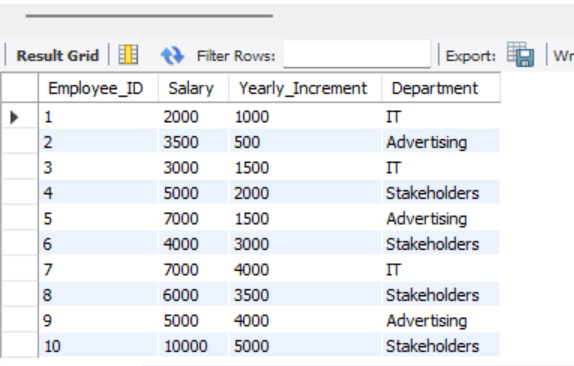
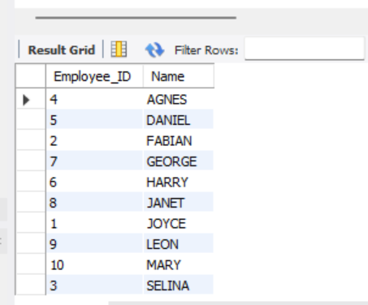
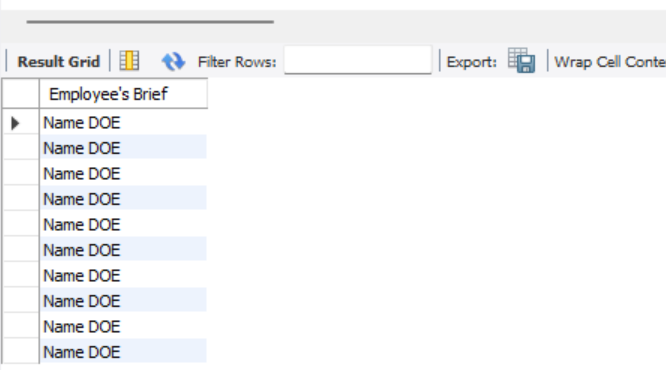

# DATA MANIPULATION

## Introduction:
This set of tasks involves the manipulation of data using SQL within the MySQL database. The primary objective of these tasks is to serve as a guide for understanding the various aspects of data manipulation within MySQL tables. Through these tasks, I have gained insights in areas such as replacing data, altering text, merging data, and data cleaning. 

The provided snapshot visually shows the changes made to the 'Department', and the command employed for this task is as follows:

_UPDATE table_name
SET department = 'stakeholders'
WHERE department = 'communication';_

The snapshot provided displays the column with updated values converted to uppercase, and the SQL syntax used is as follows:

_SELECT UPPER( name) AS NAME_

The snapshot displayed above shows the merged data of the employee's name and Date of Entry (DOE). The syntax employed is as follows:

_SELECT CONCAT(employer_name, ' ', DOE) AS "Employee’s brief"
FROM table_name;_
